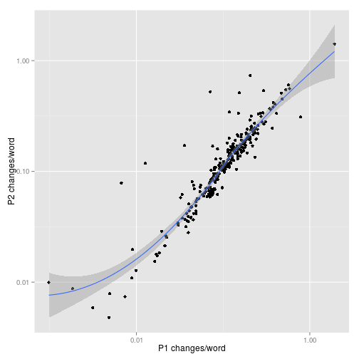

## [Project Gutenberg](https://www.gutenberg.org/)
Project Gutenberg offers over 46,000 free ebooks. All our ebooks were previously published by _bona fide_ publishers.

## [Project Gutenberg Distributed Proofreading](http://www.pgdp.net)
We digitize and diligently proofread ebooks with the help of thousands of volunteers.

## [Confidence in Page Project](http://www.pgdp.net/wiki/Confidence_in_Page_analysis)
This is an effort to develop an algorithm to help decide when we are done proofreading. A central feature of such an algorithm is a way to estimate the number of defects likely to be found in the next round of proofreading.

--- .class #id 

## [ocrdiff2](http://baqaqi.chi.il.us/pgdp/ocrdiff2.py)
Based on OCRdiff by Carlo Traverso. It compares rounds of proofreading, classifying every change.

## [The Small Dataset](http://www.pgdp.net/wiki/Confidence_in_Page_Algorithm#Small_Data_Set)
The Small Data Set is a set of 284 projects extracted in mid-January 2008. It is all projects between 4700078558b6a and 47898d0245839 inclusive. Proofer data have been anonymized, but this is still considered sensitive information and I have not been able to get permission to publish the raw dataset. Interested parties should contact the author who can request permission for specific distribution from the PGDP administration.

## What you do.

The application lets you pick specific change types to include in the metric to compare change rates from one round of proofreading to the next.

---

## Sample Graph

This graph compares the first two rounds of proofreading with the metric composed of all change types except **EQUAL**, **NEWLINE_SPLIT**, **TOTAL_MISMATCH**, and **XXLARGE_DIFF**.

 

---

## Slide 5
